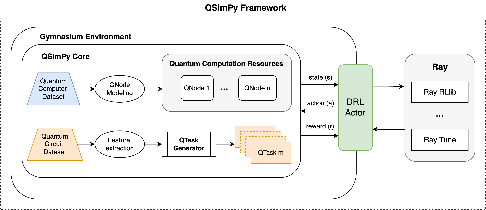
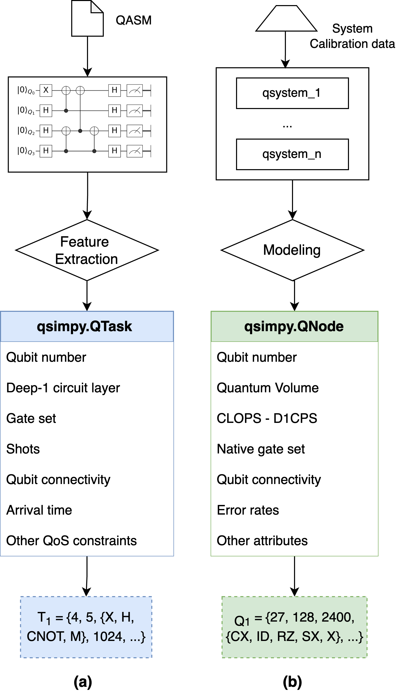
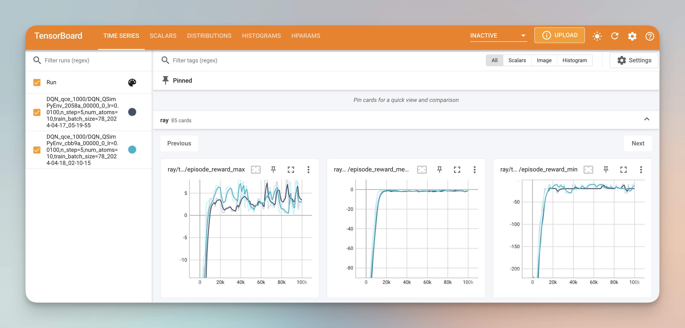

# QSimPy  
### A Discrete-Event Simulation Framework for Quantum Cloud Computing

QSimPy is a Python-based discrete-event simulation framework designed to address the challenges of designing and evaluating resource management techniques in quantum cloud computing environments. As quantum computing transitions to cloud-based services, the effective management and optimization of quantum resources become critical. QSimPy is developed to enable the design, evaluation, and optimization of resource management strategies specifically tailored for the quantum cloud.



## Features of QSimPy:

- **Discrete-Event Simulation**: Leveraging SimPy, a well-established Python-based simulation engine, QSimPy offers a robust yet lightweight framework for modeling the dynamic interactions and operations of quantum resources and tasks.
- **Integration with Gymnasium**: QSimPy integrates seamlessly with the Gymnasium environment, enhancing its capabilities in simulating and developing reinforcement learning (RL) techniques. This feature supports creating and evaluating RL-based approaches for optimizing quantum resource management.
- **Learning-Centric Environment**: QSimPy is created to facilitate learning-centric approaches. It provides a simulated environment for exploring and implementing RL strategies that consider the unique demands and operational intricacies of quantum cloud computing.
- **Extensible and Compatible**: The framework is designed with extensibility, compatibility, and reusability in mind, making it a versatile tool for academic research in quantum cloud computing. Users can extend and integrate QSimPy with other Python-based libraries and frameworks for quantum computing and machine learning to adapt to the requirements as needed.

## Getting Started
### Installation
To get started with QSimPy, you can just clone this repository and follow the installation instructions below. 

1. Clone the repository: `git clone https://github.com/QuantumAICloud/qsimpy.git`
2. Change to the project directory: `cd qsimpy`
3. Install the required dependencies: `pip install -r requirements.txt`

### Example of usage
Explore our examples to see how QSimPy can be utilized to model different scenarios and optimize resource allocation in a simulated quantum cloud environment.
#### Manual modeling and simulation
QSimPy can be used as a standalone package for creating and testing quantum cloud scenarios by importing the following code:
```
from qsimpy import Broker, QTask, QNode, Dataset
```
Then, user can create different objects to model the quantum cloud environment. Two main objects in QSimPy are QNode (quantum computing system) and QTask (quantum computation task). Each object has different attributes, defined in corresponding files. These objects can also be modeled based on all features of quantum circuits (from QASM files) for QTasks, and quantum system calibration data and system models for QNodes.

#### Synthetic datasets for QTasks and QNodes
We provided several quantum circuit datasets with all features extracted from the [MQTBench dataset](https://www.cda.cit.tum.de/mqtbench/) in the `qdataset` folder. Each CSV file contains a different subset of quantum tasks, indicated in the file name as `qsimpyds_<number of subsets>_sub_<number of QTask in each subset>.` These datasets can be used to model the dynamics of the continuous incoming workload of the quantum cloud environment. For modeling quantum tasks and quantum nodes, different attributes have been considered as follows:




#### Using QSimPy with Gymnasium
We provide example of integrating QSimPy within Gymasium in `gymenv_qsimpy.py` file. In this example, we show how to model 5 different QNodes, using the IBM Quantum system models and use a synthetic quantum tasks dataset to simulate the continuous workload of the quantum cloud environment.
Then, we implemented a simple Deep Q Network using [Ray Rllib](https://docs.ray.io/en/latest/rllib/index.html) with the example provided in the `ray_train_dqn.py` file. Experiment results will be saved to the `/results` folder and can be visualized using Tensorboard.


For technical documentation and more details in usage examples, please take a look at [our paper on arXiv](https://arxiv.org/abs/2405.01021).

> [!NOTE]  
> This is the proof-of-concept implementation of the QSimPy toolkit, and we're working to improve it further to support more comprehensive quantum cloud computing scenarios. All constructive contributions from the community to enhance QSimPy are welcome. For users who are familiar with Java and CloudSim-based simulation, we suggest checking out our related work on [iQuantum](https://github.com/Cloudslab/iQuantum).


## Reference
If you used this package or framework for your research, please kindly cite the following reference:

[1] Hoa T. Nguyen, Muhammad Usman, and Rajkumar Buyya, [“QSimPy: A Learning-centric Simulation Framework for Quantum Cloud Resource Management”](https://arxiv.org/abs/2405.01021), 2024, arXiv:2405.01021

### BibTex
```
@article{nguyen2024qsimpy,
  title         = {QSimPy: A Learning-centric Simulation Framework for Quantum Cloud Resource Management},
  author        = {Nguyen, Hoa T. and Usman, Muhammad and Buyya, Rajkumar},
  year          = {2024},
  url           = {http://arxiv.org/pdf/2405.01021},
  eprint        = {2405.01021}
}
```
